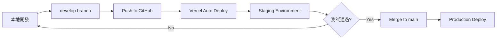

# Too-Doo-List 環境架構總覽

## 🏗️ 架構概覽

Too-Doo-List 採用**簡化雙環境架構**，充分利用 Supabase Free Plan 的 2 個 project 限制。

```
┌─────────────────────────────────────────────────────────────┐
│                     Too-Doo-List 專案                        │
├─────────────────────────────────────────────────────────────┤
│                                                              │
│  ┌────────────────────┐         ┌────────────────────┐     │
│  │   Staging 環境      │         │  Production 環境    │     │
│  │  (開發 + 測試)      │         │    (正式環境)       │     │
│  └────────────────────┘         └────────────────────┘     │
│           │                              │                   │
│           ▼                              ▼                   │
│  ┌────────────────────┐         ┌────────────────────┐     │
│  │  GitHub: develop   │         │   GitHub: main     │     │
│  └────────────────────┘         └────────────────────┘     │
│           │                              │                   │
│           ▼                              ▼                   │
│  ┌────────────────────┐         ┌────────────────────┐     │
│  │ Vercel: To Do      │         │  Vercel: To Do     │     │
│  │      Staging       │         │    Production      │     │
│  └────────────────────┘         └────────────────────┘     │
│           │                              │                   │
│           ▼                              ▼                   │
│  ┌────────────────────┐         ┌────────────────────┐     │
│  │  Supabase:         │         │   Supabase:        │     │
│  │  to-do-staging     │         │ to-do-production   │     │
│  │  (qerosiozlt...)   │         │  (ajbusqpjsj...)   │     │
│  └────────────────────┘         └────────────────────┘     │
│                                                              │
└─────────────────────────────────────────────────────────────┘
```

## 📊 環境詳細資訊

### 🔧 Staging 環境（開發 + 測試）

**用途:**
- 功能開發
- 整合測試
- UI/UX 測試
- Bug 修復驗證

**配置:**

| 項目 | 詳細資訊 |
|-----|---------|
| **Git Branch** | `develop` |
| **Vercel Project** | To Do Staging |
| **Vercel Domain** | `to-do-staging.vercel.app` |
| **Supabase Project** | to-do-staging |
| **Supabase ID** | qerosiozltqrbehctxdn |
| **Supabase Region** | ap-southeast-1 (Singapore) |
| **Supabase URL** | `https://qerosiozltqrbehctxdn.supabase.co` |
| **環境變數前綴** | `_DEV` 或 `_STAGING` |

**環境變數:**
```bash
EXPO_PUBLIC_APP_ENV=development
EXPO_PUBLIC_SUPABASE_URL_DEV=https://qerosiozltqrbehctxdn.supabase.co
EXPO_PUBLIC_SUPABASE_ANON_KEY_DEV=your-staging-anon-key
EXPO_PUBLIC_ENABLE_DEBUG=true
EXPO_PUBLIC_ENABLE_ANALYTICS=false
```

**特性:**
- ✅ Debug 模式啟用
- ✅ 詳細的 Console 輸出
- ✅ 可以自由測試和修改資料
- ✅ 不影響正式環境
- ❌ Analytics 關閉

---

### 🚀 Production 環境（正式）

**用途:**
- 正式上線
- 真實用戶服務
- 生產環境

**配置:**

| 項目 | 詳細資訊 |
|-----|---------|
| **Git Branch** | `main` |
| **Vercel Project** | To Do Production |
| **Vercel Domain** | `to-do-dev-alan.vercel.app` |
| **Supabase Project** | to-do-production (原 to-do-dev) |
| **Supabase ID** | ajbusqpjsjcuzzxuueij |
| **Supabase Region** | ap-south-1 (Mumbai) |
| **Supabase URL** | `https://ajbusqpjsjcuzzxuueij.supabase.co` |
| **環境變數前綴** | (無) 或 `_PROD` |

**環境變數:**
```bash
EXPO_PUBLIC_APP_ENV=production
EXPO_PUBLIC_SUPABASE_URL=https://ajbusqpjsjcuzzxuueij.supabase.co
EXPO_PUBLIC_SUPABASE_ANON_KEY=your-production-anon-key
EXPO_PUBLIC_ENABLE_DEBUG=false
EXPO_PUBLIC_ENABLE_ANALYTICS=true
```

**特性:**
- ❌ Debug 模式關閉
- ❌ Console 輸出最小化
- ✅ 嚴格的資料保護
- ✅ 完整的 RLS 策略
- ✅ Analytics 啟用

---

## 🔄 工作流程

### 開發流程



### 詳細步驟

**1. 本地開發 (Staging)**
```bash
# 切換到 develop 分支
git checkout develop

# 開發新功能
# ... coding ...

# 本地測試（連接 Staging Supabase）
npm start

# Commit 變更
git add .
git commit -m "[feat] 新功能描述 (v1.x.x)"
```

**2. 推送到 Staging**
```bash
# 推送到 develop 分支
git push origin develop

# Vercel 自動部署到 Staging
# 訪問: https://too-doo-list-staging.vercel.app
# 進行完整測試
```

**3. 發布到 Production**
```bash
# 測試通過後，合併到 main
git checkout main
git merge develop

# 更新版本號（如需要）
# 編輯 app.config.js 和 package.json

# 推送到 main
git push origin main

# Vercel 自動部署到 Production
# 訪問: https://to-do-dev-alan.vercel.app
```

---

## 🔐 安全性與隔離

### 資料隔離

| 項目 | Staging | Production |
|-----|---------|-----------|
| **資料庫** | 測試資料 | 真實用戶資料 |
| **可修改性** | ✅ 可自由修改 | ❌ 嚴格保護 |
| **備份頻率** | 每週 | 每日 |
| **RLS 策略** | 較寬鬆 | 嚴格執行 |

### 環境變數隔離

- ✅ 完全不同的 Supabase URL
- ✅ 完全不同的 API Keys
- ✅ 獨立的 OAuth 設定
- ✅ 不同的 Feature Flags

### API 端點隔離

**Staging:**
- API: `qerosiozltqrbehctxdn.supabase.co`
- Auth: `qerosiozltqrbehctxdn.supabase.co/auth/v1`
- Storage: `qerosiozltqrbehctxdn.supabase.co/storage/v1`

**Production:**
- API: `ajbusqpjsjcuzzxuueij.supabase.co`
- Auth: `ajbusqpjsjcuzzxuueij.supabase.co/auth/v1`
- Storage: `ajbusqpjsjcuzzxuueij.supabase.co/storage/v1`

---

## 📝 環境對應表

### 完整對應關係

| 元素 | Staging | Production |
|------|---------|-----------|
| **目的** | 開發和測試 | 正式環境 |
| **Git Branch** | `develop` | `main` |
| **Vercel Project** | To Do Staging | To Do Production |
| **Vercel URL** | to-do-staging.vercel.app | to-do-dev-alan.vercel.app |
| **Supabase Project** | to-do-staging | to-do-production |
| **Supabase ID** | qerosiozlt... | ajbusqpjsj... |
| **Region** | Singapore | Mumbai |
| **APP_ENV** | development | production |
| **Debug Mode** | ✅ Enabled | ❌ Disabled |
| **Analytics** | ❌ Disabled | ✅ Enabled |
| **Auto Deploy** | ✅ On push to develop | ✅ On push to main |

### 環境變數命名

| 用途 | Staging | Production |
|-----|---------|-----------|
| **Supabase URL** | `EXPO_PUBLIC_SUPABASE_URL_DEV` | `EXPO_PUBLIC_SUPABASE_URL` |
| **Supabase Key** | `EXPO_PUBLIC_SUPABASE_ANON_KEY_DEV` | `EXPO_PUBLIC_SUPABASE_ANON_KEY` |
| **Alternative URL** | `EXPO_PUBLIC_SUPABASE_URL_STAGING` | `EXPO_PUBLIC_SUPABASE_URL_PROD` |
| **Alternative Key** | `EXPO_PUBLIC_SUPABASE_ANON_KEY_STAGING` | `EXPO_PUBLIC_SUPABASE_ANON_KEY_PROD` |

---

## 🎯 最佳實踐

### DO ✅

1. **開發流程**
   - ✅ 在 Staging 環境充分測試
   - ✅ 確認所有功能正常後才合併到 main
   - ✅ 使用語義化版本控制（Semantic Versioning）
   - ✅ 定期同步 develop 和 main 分支

2. **安全性**
   - ✅ 不在代碼中硬編碼 API 金鑰
   - ✅ 使用環境變數管理敏感資訊
   - ✅ 定期檢查和輪換 API 金鑰
   - ✅ 為 Production 設定更嚴格的 RLS 策略

3. **部署**
   - ✅ 利用 Vercel 的自動部署
   - ✅ 檢查部署日誌確認成功
   - ✅ 部署後進行冒煙測試
   - ✅ 保持回滾能力

### DON'T ❌

1. **開發流程**
   - ❌ 直接在 main 分支開發
   - ❌ 跳過 Staging 測試直接部署到 Production
   - ❌ 忘記更新版本號
   - ❌ Commit 未經測試的代碼

2. **安全性**
   - ❌ 在 Production 環境測試
   - ❌ 使用 Production 資料進行開發
   - ❌ 分享 API 金鑰或環境變數
   - ❌ 將 `.env` 文件提交到 Git

3. **資料管理**
   - ❌ 將 Staging 資料遷移到 Production
   - ❌ 在 Production 手動修改資料（除非緊急）
   - ❌ 忘記備份重要資料
   - ❌ 混淆兩個環境的資料

---

## 🔧 故障排除

### 問題 1: 環境連接錯誤

**症狀:** 應用連接到錯誤的 Supabase 專案

**檢查步驟:**
```bash
# 1. 確認當前環境
console.log('Environment:', process.env.EXPO_PUBLIC_APP_ENV);
console.log('Supabase URL:', process.env.EXPO_PUBLIC_SUPABASE_URL);

# 2. 檢查環境變數設定
# Vercel: Settings → Environment Variables
# 本地: 檢查 .env.local 文件

# 3. 重新部署或重啟本地服務
npm start --clear  # 本地
# 或在 Vercel Dashboard 手動 Redeploy
```

### 問題 2: OAuth 重定向失敗

**檢查清單:**
- [ ] Google Cloud Console Redirect URI 設定正確
- [ ] Supabase Site URL 設定正確
- [ ] Vercel 域名與設定的 Redirect URI 一致
- [ ] 環境變數中的 Supabase URL 正確

### 問題 3: 資料不同步

**原因:** 兩個環境使用不同的資料庫

**解決方法:**
- Staging 和 Production 資料**應該**保持隔離
- 如需同步結構，使用 Migration 檔案
- 不要手動複製資料

---

## 📚 相關文檔

### 核心文檔
- [ENVIRONMENT_VARIABLES.md](./ENVIRONMENT_VARIABLES.md) - 環境變數詳細配置
- [SUPABASE_ENVIRONMENTS.md](./SUPABASE_ENVIRONMENTS.md) - Supabase 環境設定
- [VERCEL_DEPLOYMENT.md](./VERCEL_DEPLOYMENT.md) - Vercel 部署指南

### 設定指南
- [ENV_SETUP_INSTRUCTIONS.md](./ENV_SETUP_INSTRUCTIONS.md) - 環境設定快速指南
- [GOOGLE_OAUTH_SETUP.md](./GOOGLE_OAUTH_SETUP.md) - Google OAuth 設定
- [SUPABASE_SETUP.md](./SUPABASE_SETUP.md) - Supabase 初始設定

### 開發規範
- [README.md](./README.md) - 專案總覽
- 專案開發規則（在 Cursor Rules 中）

---

## 🎓 學習資源

### Supabase
- [Supabase Docs](https://supabase.com/docs)
- [Supabase CLI](https://supabase.com/docs/guides/cli)
- [Row Level Security](https://supabase.com/docs/guides/auth/row-level-security)

### Vercel
- [Vercel Docs](https://vercel.com/docs)
- [Environment Variables](https://vercel.com/docs/environment-variables)
- [Git Integration](https://vercel.com/docs/git)

### React Native / Expo
- [Expo Docs](https://docs.expo.dev/)
- [React Native Docs](https://reactnative.dev/docs)

---

## 📞 支援

遇到問題？查看以下資源：

1. **檢查文檔:** 相關配置文檔中的故障排除章節
2. **檢查日誌:** Vercel Deployment Logs、Supabase Logs
3. **環境驗證:** 確認環境變數和配置正確
4. **測試流程:** 在 Staging 環境重現問題

---

**最後更新:** 2025-10-26  
**架構版本:** 2.0 (雙環境架構)  
**維護者:** Too-Doo-List Team

